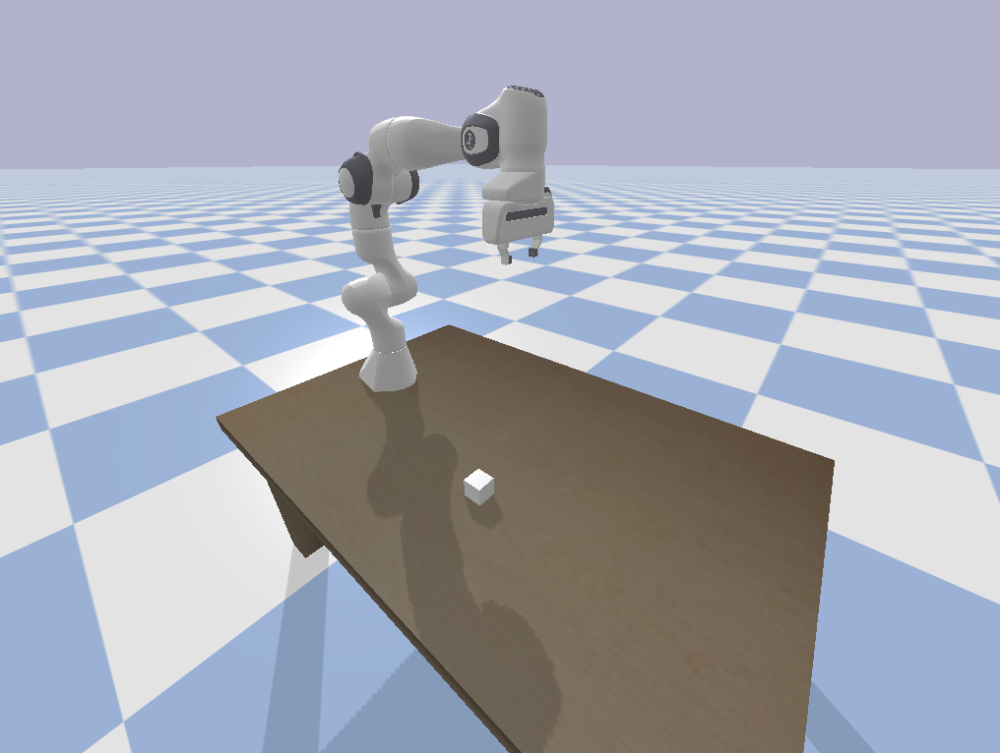

# panda-teleop

A minimal implementation to teleoperate the panda robot arm.

## Install and Run

```bash

# Download
git clone https://github.com/panda-sim/panda-teleop.git
cd panda-teleop

# Create and source virtual environment
python3 -m venv venv
source venv/bin/activate

# Install dependencies
pip install numpy pybullet pygame

# Run the script
python main.py
```

## Expected Output

Use the keyboard letters `wasd` (and others listed in teleop.py) to move the robot.
The initial scene is shown below.

